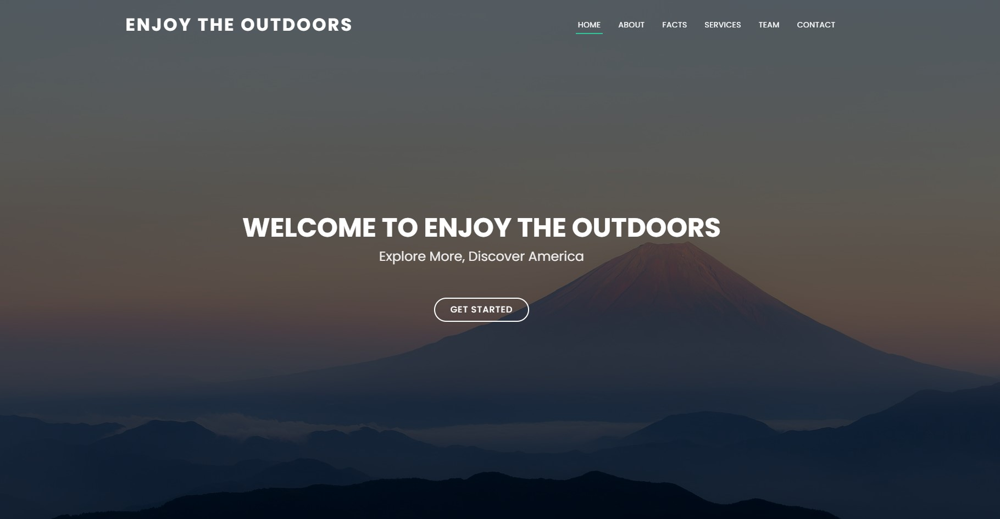

# EnjoyTheOutdoors
This is my second capstone project made for Year Up Spring 2024 Application Development track.

# About this Project
"Enjoy the Outdoors" is a dedicated platform for nature enthusiasts and adventurers alike, offering comprehensive resources on national parks and mountains across the United States. Users can easily access information about national parks by searching based on their location or by the type of park they are interested in exploring.

# Pictures of the Front Page
<figure>
    
    <figcaption>Front Page - Front Hero Section</figcaption>
</figure>

<figure>
    
    <figcaption>Front Page - About Us Section</figcaption>
</figure>

<figure>
    
    <figcaption>Front Page - Facts Section</figcaption>
</figure>

<figure>
    
    <figcaption>Front Page - Services Section</figcaption>
</figure>

<figure>
    
    <figcaption>Front Page - Team Section</figcaption>
</figure>

<figure>
    
    <figcaption>Front Page - Contact Section</figcaption>
</figure>

# Pictures of the National Park Page
<figure>
    
    <figcaption>National Park Page - Options Section</figcaption>
</figure>

<figure>
    
    <figcaption>National Park Page - Location Checked</figcaption>
</figure>

<figure>
    
    <figcaption>National Park Page - Park Type Checked</figcaption>
</figure>

<figure>
    
    <figcaption>National Park Page - All Parks Checked</figcaption>
</figure>

# Pictures of the Mountains Page
<figure>
    
    <figcaption>Mountains Page - All Mountains Section</figcaption>
</figure>

<figure>
    
    <figcaption>Mountains Page - Mountain Details Section</figcaption>
</figure>

